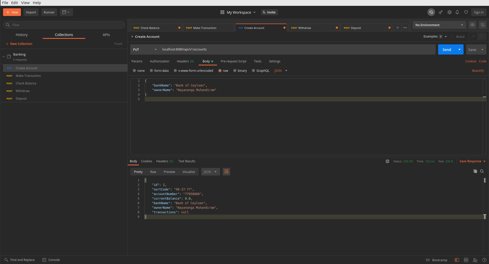
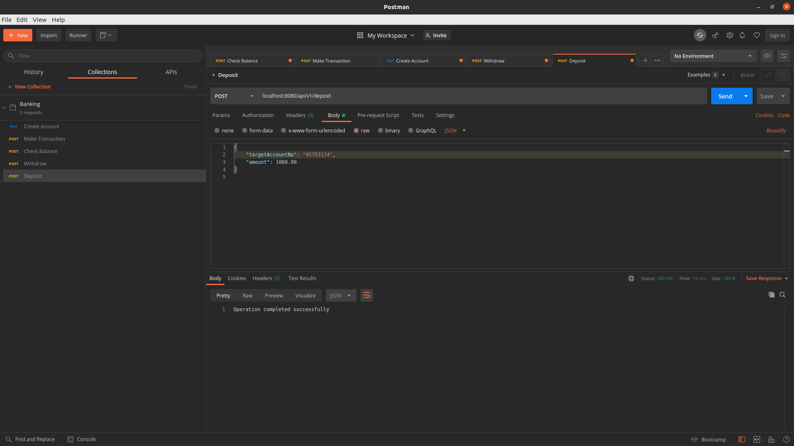
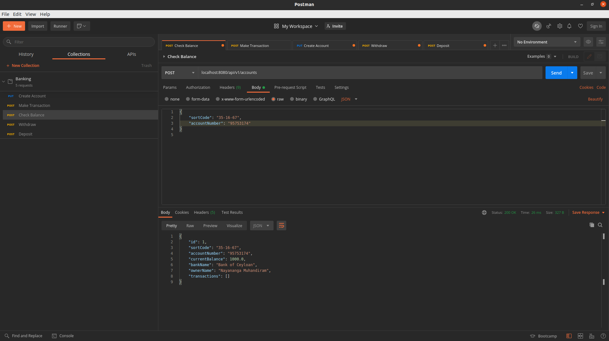
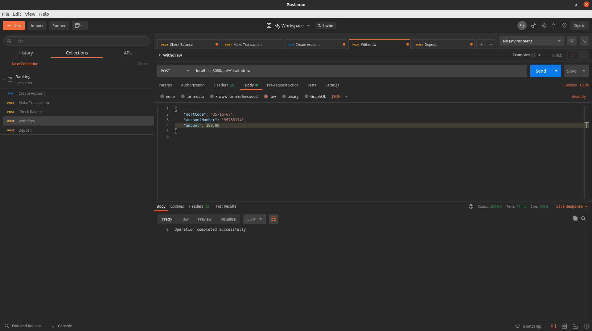
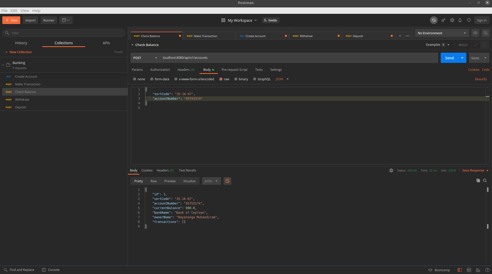

# Finance System
- Developed a scalable finance backend system using Spring Boot with RESTful services for account management and transaction processing.
- Integrated Generex to generate random strings for account numbers and sort codes, and utilized Spring Validator for input validation.
- Designed entity relationships with Spring Data JPA and H2 Database to enable seamless CRUD operations and conducted comprehensive API testing using JUnit for reliability.
## Testing
Import the Postman collection file into the application or copy the request body from there

### How to test
1. Create account
   > Use create account API to create an account by providing a `bankName` and `ownerName`
   > 
   

> Make sure to write down the `sortCode` and the `accountNumber` to proceed with other APIs

2. Deposit Cash
   >Use noted `accountNumber` as `targetAccountNo` and provide amount greater than zero to deposit cash into an account
   
   

3. Check Balance
   >Use noted `accountNumber` and `sortCode` to check account balance

   
   
4. Withdraw Cash
   >Use noted `accountNumber` and `sortCode` and `amount` grater than zero to withdraw cash from an account

   
    
5. Check Balance again to verify withdrawal

   
   

### Extensions
1. Use of persisted database
2. Use of asynchronous programming backed by message queue for transactions
3. Others mentioned throughout the code
